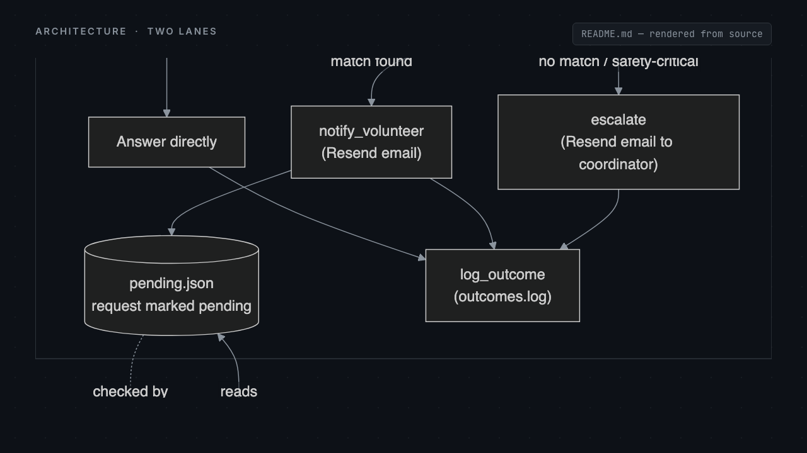
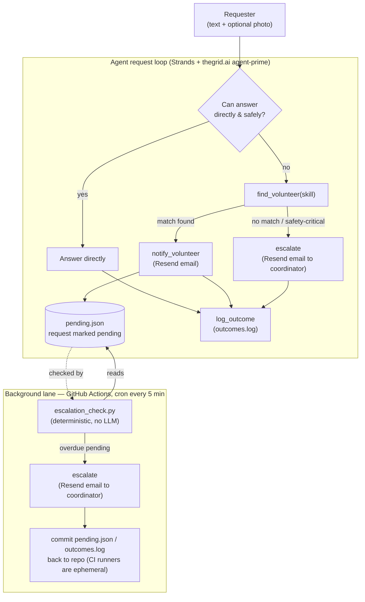

# Good Neighbor Agent

Built for the [Agents for Humans Hackathon](https://agentsforhumans.devpost.com/) (AWS/Devpost) — **Good Neighbor Agents** track.

## Demo video

[](https://github.com/kazani-351/good-neighbor-agent/blob/main/demo/good-neighbor-agent-demo.mp4)

5 minutes, narrated. Every agent-behavior segment is a real captured run against real
thegrid.ai and Resend calls — not staged. Click the thumbnail to watch (GitHub plays it
inline on the file page), or go straight to
[demo/good-neighbor-agent-demo.mp4](demo/good-neighbor-agent-demo.mp4).

## What it does

Coordinates accessibility requests for a volunteer network. A requester submits a task in
plain text plus an optional photo (e.g. "what does this prescription label say"). The agent:

1. Tries to answer directly using its own reasoning/vision if confident and safe to do so.
2. If not confident, or the task needs local/physical human judgment, finds an available
   volunteer and notifies them.
3. If no volunteer responds within the timeout window, escalates to a human coordinator.
4. Logs the outcome either way.

It only surfaces to a human when there's a real decision to make — everything else runs
autonomously.

## Status

Phase 1 complete and verified: direct-answer, volunteer routing (real email via Resend),
autonomous escalation-on-timeout (live GitHub Actions cron), and safety-critical escalation
have all been proven with real runs against real services.

## Architecture



Two lanes: the synchronous agent loop handles each request as it comes in; a separate
scheduled job (no LLM involved) sweeps `pending.json` for anything that timed out
(`ESCALATION_TIMEOUT_MINUTES`, default 10) and escalates it on its own.

## Stack

- [Strands Agents SDK](https://strandsagents.com/) — agent loop + tool calling
- [thegrid.ai](https://thegrid.ai/) (`agent-prime` instrument) via Strands' OpenAI-compatible
  provider — no AWS billing account required
- [Resend](https://resend.com/) — volunteer notification (planned, not yet wired). Swapped in
  for SES since SES needs a billed AWS account this project deliberately avoids.

Submission requires an AWS Builder ID (free, no card — [builder.aws.com/start](https://builder.aws.com/start)),
not a full billed AWS account. AgentCore deployment is an optional bonus per the hackathon
rules, not required — this project skips it to avoid AWS account setup entirely.

## Local setup

```bash
python3 -m venv .venv
source .venv/bin/activate
pip install -r requirements.txt
cp .env.example .env   # then fill in THEGRID_API_KEY (a Consumption key from app.thegrid.ai)
python -m app.good_neighbor_agent.agent
```

## Project layout

```
app/good_neighbor_agent/
├── __init__.py
├── agent.py             # agent definition + entrypoint
├── tools.py             # find_volunteer, notify_volunteer, escalate, log_outcome
├── roster.py            # volunteer roster (JSON-backed), overrides matched email with DEMO_INBOX
├── pending.py           # tracks requests awaiting a volunteer response
└── escalation_check.py  # standalone timeout sweep, no LLM — run by the cron below
volunteers.json          # seed data
pending.json             # request state (committed back to repo by CI — see workflow below)
outcomes.log             # log_outcome history
.github/workflows/escalation-check.yml  # cron every 5 min, runs escalation_check.py
```

## License

MIT (required by hackathon rules — see LICENSE).
